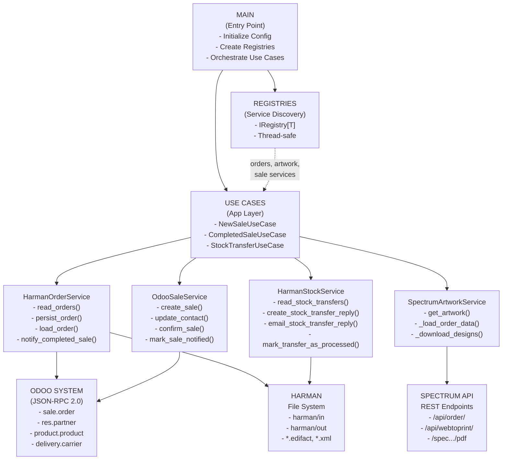
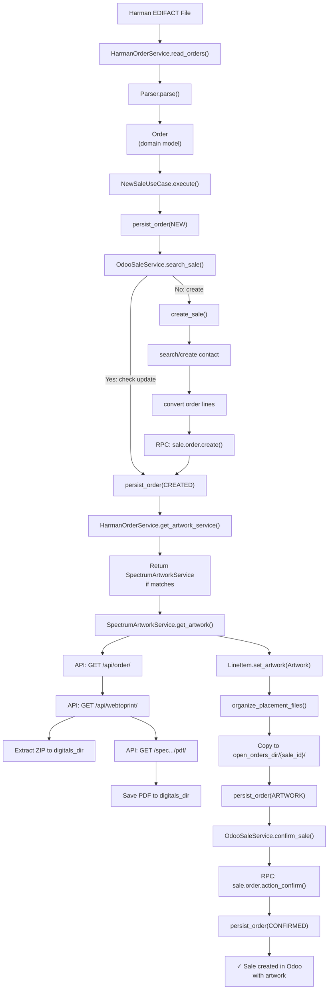
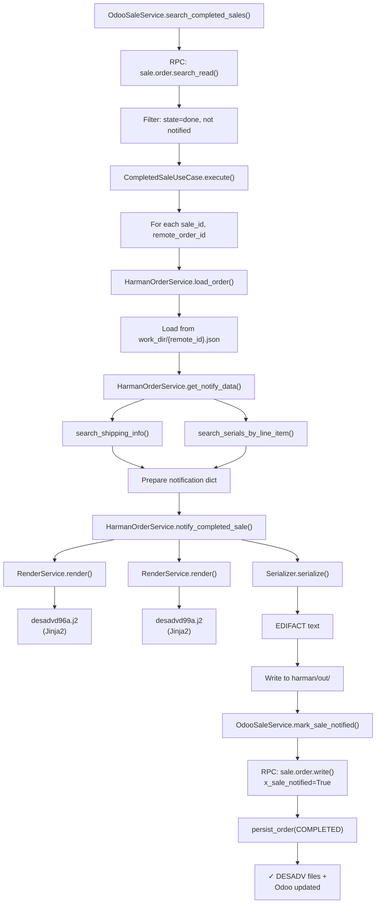
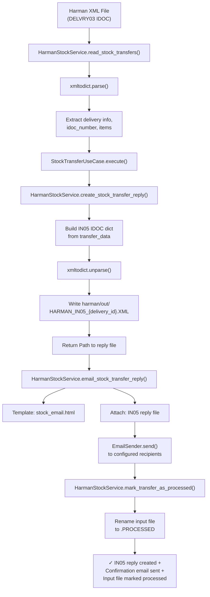
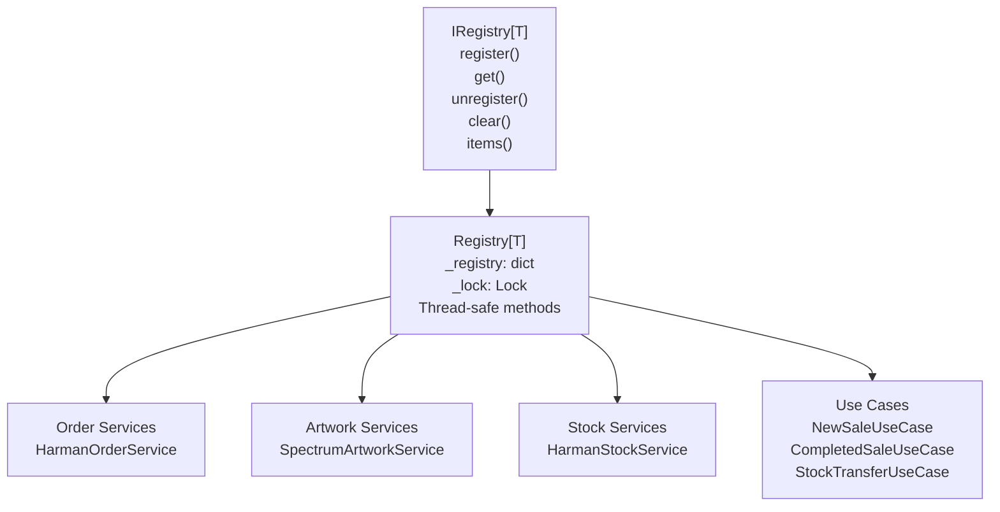
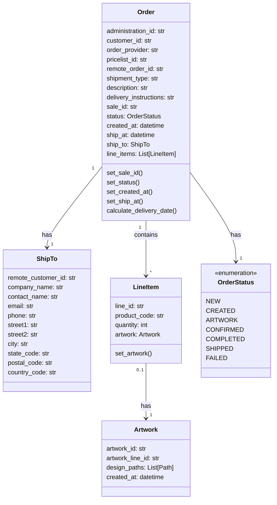
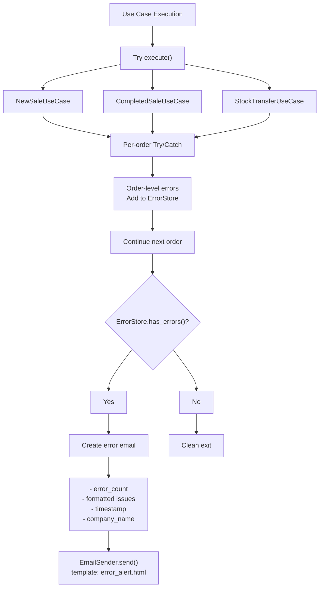

# Architecture Diagram - Deonet External Order Processing

## Component Architecture

## Data Flow Diagram

### New Sale Workflow

### Completed Sale Workflow

### Stock Transfer Workflow

## Service Registry Pattern

## Domain Model Hierarchy

## Error Handling Flow

